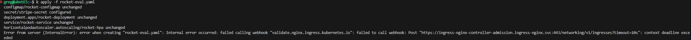
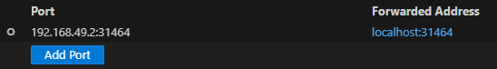
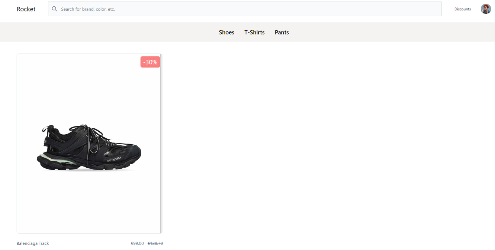
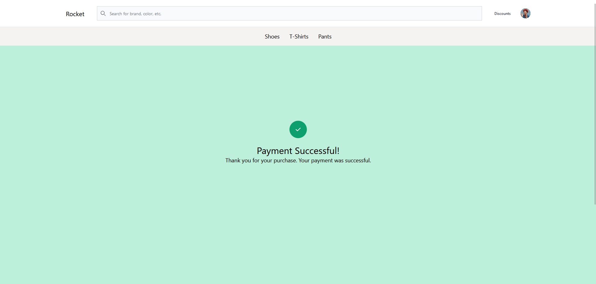
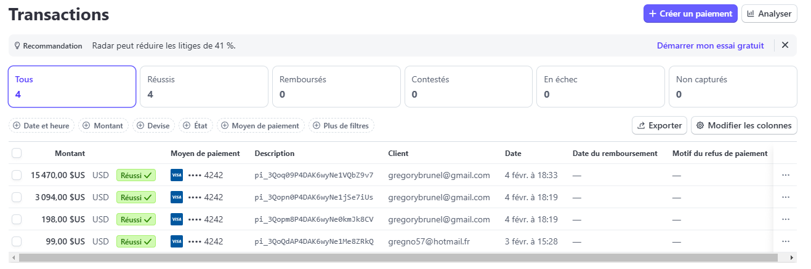

# E5-CCISP
BRUNEL Grégory


<!-- PROJECT LOGO --> <br /> <div align="center"> <h3 align="center">Projet Kubernetes : Applications e-commerce </h3> <p align="center"> 


Contenu du manifest.yaml
```bash

apiVersion: v1
kind: ConfigMap
metadata:
  name: rocket-configmap
  namespace: rocket-eval
data:
  DEMO_MODE: "True"
  DEBUG: "True"
---
apiVersion: v1
kind: Secret
metadata:
  name: stripe-secret
  namespace: rocket-eval
type: Opaque
stringData:
  STRIPE_PUBLISHABLE_KEY: pk_test_51QkNzwP4DAK6wyNeh4H8hTqHzzvG5kUHb0gWwmLKVQerrYcBXD1fw1QxPwKg3Jum316NQyS8zMVvvHDePwqKeJPC00TMqRfZ9C
  STRIPE_SECRET_KEY: sk_test_51QkNzwP4DAK6wyNeq8cCUdiXIlxe1StTRGLhkuK9I0xUEjY9K8dWlVR5O3CJehWCv3PuINgjaTZSgtMVcC8hefbm000mFFMaab
---
apiVersion: apps/v1
kind: Deployment
metadata:
  name: rocket-deployment
  namespace: rocket-eval
  labels:
    app: django
    env: preprod
    tier: frontend
spec:
  selector:
    matchLabels:
      app: django
  replicas: 1
  template:
    metadata:
      labels:
        app: django
        env: preprod
        tier: frontend
    spec:
      containers:
      - name: rocket-random
        image: rocket-app:latest
        imagePullPolicy: IfNotPresent
        resources:
          requests:
            memory: 64Mi
            cpu: 250m
          limits:
            memory: 120Mi
            cpu: 300m
        envFrom:
        - configMapRef:
            name: rocket-configmap
        env:
          - name: STRIPE_PUBLISHABLE_KEY
            valueFrom:
              secretKeyRef:
                name: stripe-secret
                key: STRIPE_PUBLISHABLE_KEY
          - name: STRIPE_SECRET_KEY
            valueFrom:
              secretKeyRef:
                name: stripe-secret
                key: STRIPE_SECRET_KEY
---
apiVersion: v1
kind: Service
metadata:
  name: rocket-service
  namespace: rocket-eval
spec:
  type: LoadBalancer
  selector:
    app: django
  ports:
  - port: 5005
    targetPort: 5005
    name: django-np
---
apiVersion: networking.k8s.io/v1
kind: Ingress
metadata:
  name: ingress-rocketapp
  namespace: rocket-eval
spec:
  defaultBackend:
    service:
      name: rocket-service
      port:
        number: 7777
---
apiVersion: autoscaling/v2
kind: HorizontalPodAutoscaler
metadata:
  name: rocket-hpa
  namespace: rocket-eval
spec:
  scaleTargetRef:
    apiVersion: apps/v1
    kind: Deployment
    name: rocket-deployment
  minReplicas: 1
  maxReplicas: 5
  metrics:
  - type: Resource
    resource:
      name: cpu
      target:
        type: Utilization
        averageUtilization: 50
```
Problèmes rencontrés :

Impossible d'accéder à l'application sur Internet. Malgré plusieurs essais, je n'ai pas réussi à trouver d'où venait le problème. Même après avoir effectué un "K delete" et recommencé, rien n'a changé. J'ai également essayé de désactiver le pod autoscaler pour voir si le problème venait de là, mais ce n'était pas le cas.

## Manifest réalisé hier fonctionnel. 

. Contenu du manifest.yaml

``` apiVersion: v1
kind: ConfigMap
metadata:
  name: django-app-configmap
data:
  DEMO_MODE: "True"
  DEBUG: "True"
---
apiVersion: v1
kind: Secret
metadata:
  name: stripe-secret
type: Opaque
# Pour mettre les secrets en claires, il faut utiliser "stringData:", sinon, il va falloir les hasher en base64
stringData:
#data:
  STRIPE_PUBLISHABLE_KEY: pk_test_51QkNzwP4DAK6wyNeh4H8hTqHzzvG5kUHb0gWwmLKVQerrYcBXD1fw1QxPwKg3Jum316NQyS8zMVvvHDePwqKeJPC00TMqRfZ9C
  STRIPE_SECRET_KEY: sk_test_51QkNzwP4DAK6wyNeq8cCUdiXIlxe1StTRGLhkuK9I0xUEjY9K8dWlVR5O3CJehWCv3PuINgjaTZSgtMVcC8hefbm000mFFMaab
---
apiVersion: apps/v1
kind: Deployment
metadata:
  name: django-deployment
  # Labels du deployment
  labels:
    app: django
    env: preprod
    tier: frontend
spec:
  selector:
    matchLabels:
      app: django
  replicas: 1
  template:
    metadata:
      # Labels des pods
      labels:
        app: django
        env: preprod
        tier: frontend
    spec:
      containers:
      - name: django-random
        image: soso725/rocketecommerce:beta
        resources:
          requests:
            memory: 64Mi
            cpu: 250m
          limits:
            memory: 128Mi
            cpu: 400m
        envFrom:
        - configMapRef:
            # nom de la configMap
            name: django-app-configmap
        env:
          # nom de la variable qui sera injectée
          - name: STRIPE_PUBLISHABLE_KEY
            valueFrom:
              secretKeyRef:
                # nom de l'objet secret
                name: stripe-secret
                # nom du secret précis
                key: STRIPE_PUBLISHABLE_KEY
          - name: STRIPE_SECRET_KEY
            valueFrom:
              secretKeyRef:
                name: stripe-secret
                key: STRIPE_SECRET_KEY
---
apiVersion: v1
kind: Service
metadata:
  # name: django-new-service
  name: django-service
spec:
  type: LoadBalancer
  selector:
    app: django
  ports:
  - port: 5005
    targetPort: 5005
    # nodePort: 30001
    name: django-np
---
apiVersion: networking.k8s.io/v1
kind: Ingress
metadata:
  name: ingress-djangoapp
spec:
  defaultBackend:
    service:
      name: django-service
      port:
        number: 7777
```
Preuve du fonctionnement ci dessous :

<!-- GETTING STARTED -->

### Pour déployer les applications

1- Exécuter la commande suivante pour mettre en place vos application avec le manifest:

``` bash
k create -f "nom du fichier.yaml" 
```

2- Et vous pouvez voir vos application déployer en faisant:

``` bash
k get all
```
<!-- INTERFACES -->
## Quelques interfaces

. Redirection de port 

. Page d'acceuil application 

. Page presentation produits

. Page de paiement 

. Transation sur stripe 



## Choix des frameworks


Django & Flask : Frameworks légers et efficaces pour le développement web

Stripe : Simplifie l'intégration des paiements

Rocket Django : Solution robuste et bien structurée pour des projets évolutifs


